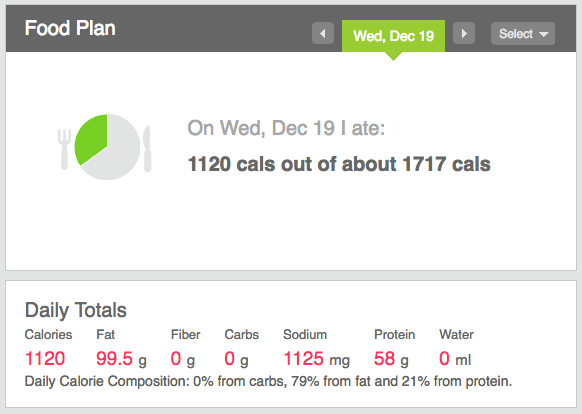
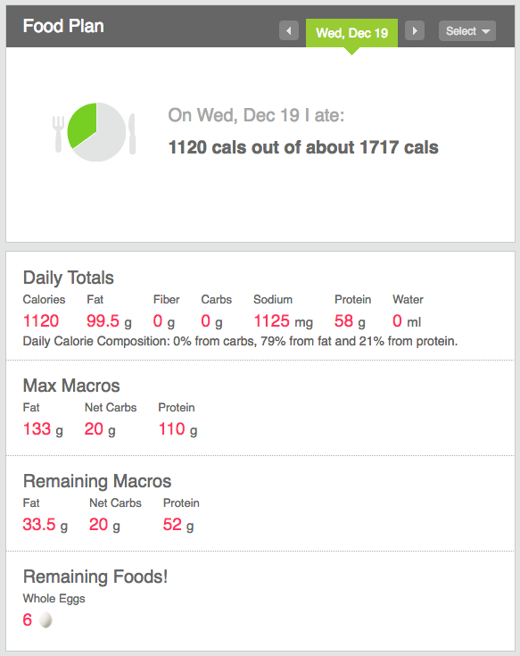

# Macro-Thetical

Play on word "hypothetical". Personal health is really important to me, but sometimes I don't want to think about how much I have left in my macro/caloric allowance. The math is really simple so why not adapt the fitbit user-experience to take some of the work out of it?

### Before

### After

## Installation
Depends on your browser, you need a browser that can handle userscripts (any modern browser 😃)

- [Greasemonkey](https://addons.mozilla.org/en-US/firefox/addon/greasemonkey/)
  - Firefox
- [Tampermonkey](https://chrome.google.com/webstore/detail/tampermonkey/dhdgffkkebhmkfjojejmpbldmpobfkfo?hl=en)
  - Chrome
  - Firefox
  - Microsoft Edge
  - Safari
  - Opera

After you've installed the extension, browse to the userscript to install it and grant permissions to the page.

[Click here to install the script!](https://github.com/paul-nelson-baker/macro-thectical/raw/master/macro-thetical.user.js)